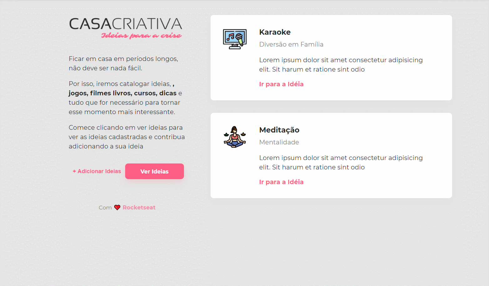

<h1 align="center">
  
</h1>

## 💻 Detalhes do projeto

O sistema tem como objetivo criar uma aplicação para catalogar ideias de jogos, filmes, livros, cursos e dicas durante a quarentena. O projeto foi desenvolvido pela empresa [Rocketseat](https://rocketseat.com.br/) em um Workshop especial de 5 episódios no YouTube, link da série: https://www.youtube.com/watch?v=cprMYC8PCVY&list=PL85ITvJ7FLohGTWaE_p0J6B-TLmQbN4ka&index=1 

<h1 align="center">
    
</h1>

## :rocket: Tecnologias utilizadas no projeto

As tecnologias utilizadas no projeto foram:

- [HTML5](https://developer.mozilla.org/en-US/docs/Web/Guide/HTML/HTML5)
- [CSS3](https://developer.mozilla.org/en-US/docs/Web/CSS)
- [JavaScript](https://developer.mozilla.org/en-US/docs/Web/JavaScript)
- [Node.js](https://nodejs.org/)
- [Express.js](https://expressjs.com/)
- [Nunjucks](https://mozilla.github.io/nunjucks/)
- [NPM](https://www.npmjs.com/)
- [Nodemon](https://nodemon.io/)
- [SQLite3](https://www.sqlite.org/version3.html)

- Obs: o site [Flaticon](https://www.flaticon.com/) foi utilizado para buscar as imagens para adicionar junto as idéias

## :heavy_plus_sign: Funcionalidades adicionais

- Ao clicar no ícone da lampâda ao lado da label do Link da Imagem, sugere um site para clicar e buscar as imagens
- Ao passar mouse em um card de idéia da lista ou dos mais recentes, aparece um ícone de lixeira para fazer a exclusão
- Criado o modal de confirmação para exclusão das idéias
- Criado o metodo de exclusão no server.js


## :package: Como utilizar o projeto

É preciso ter instalado no computador o [Git](https://git-scm.com) e o [Node.js](https://nodejs.org/) para rodar o projeto através das linhas de comando. O projeto também pode ser baixado no formato zip clicando no botão "Code" na opção "Download ZIP"

```bash

    # Clonar o repositório
    $ git clone https://github.com/alexvieirasj/casa-criativa.git

    # Entrar no diretório baixado
    $ cd casa-criativa

    # Instalar as dependências        
    $ npm install 

    # Iniciar o projeto
    $ npm run dev 
    
    # running on port 3000 
```

## :memo: Licença

Este projeto está sob a MIT License. Acesso o arquivo [LICENSE](https://github.com/alexvieirasj/casa-criativa/blob/master/LICENSE) para maiores detalhes.

